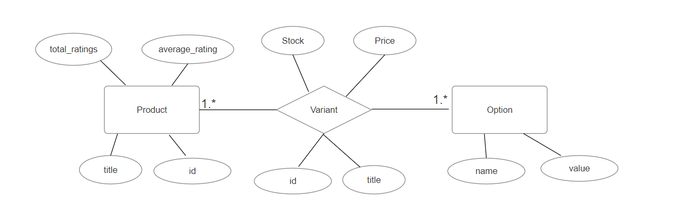

# Current Schema Problems

## Products Table
1. The `average_rating` column alone is insufficient to update the rating with new user ratings.  It should be accompanied by a `total_ratings` column to be able to compute the new average upon every new submitted product rating.
2. The `is_in_stock` column is redundant. Users interact with product variants rather than the product as a whole. This column can easily become outdated if not synchronized with the addition or removal of variants.

## Variants Table
1. The `is_in_stock` column is unnecessary since the stock can be inferred from the stock quantity directly. This redundancy can lead to data inconsistencies without proper synchronization.
2. Storing `options` in both the Variants and Products tables is suboptimal, particularly as options are strings unrelated to the Options table. It also leads ambiguity and confusion, as options are common in both Product and Variant, which also lead to inconsistency and data redundancy. 

## Options Table
- Storing option values as a list promotes value repetition across the table, which can hinder scalability and lead to data inconsistencies. For example, multiple entries in the Options table might have the same name and value list if multiple products share the same size options for instance.

## Proposed Schema

The following is an Entity-Relationship Diagram (ERD) of the proposed design:

- **Product:** Represents a generic or abstract product, like a T-shirt.
- **Option Table:** It now contains name-value pairs instead of a list of values for each row. Sample entries could include: (size, small), (size, large), (material, cotton), (material, wool), (color, red), (brand, GAP), (brand, Levi's) etc.
- **Variant Table:** Intermediary/Pivot table modelling the many-to-many relationship between Product and Option. It includes variant-specific information like price, stock, and title (e.g., "Red Small Polo Shirt made of Cotton").
